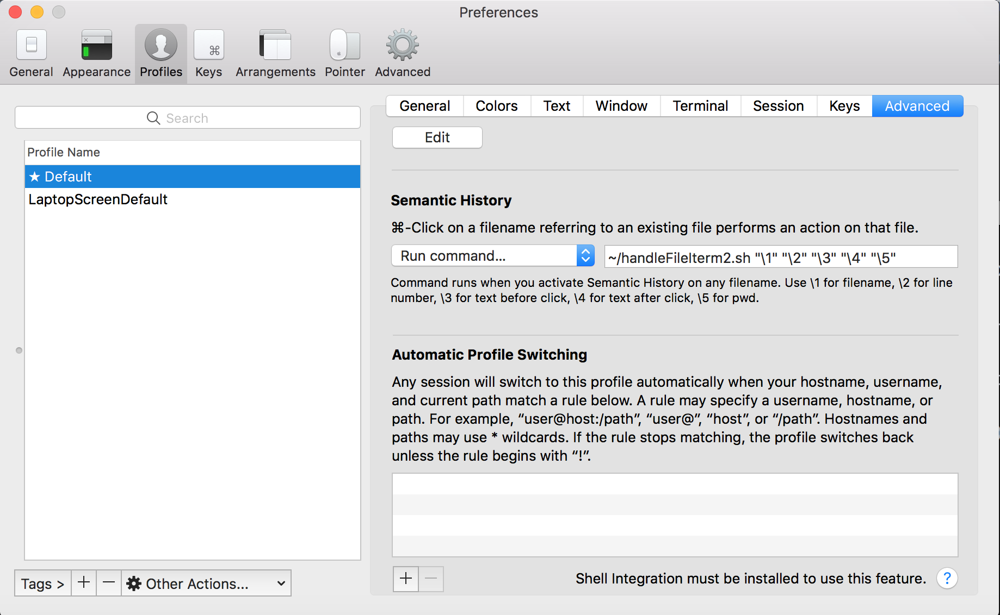

# IntelliJ Idea integration in Iterm2
This repository contains a script, `handleFileIterm2.sh` which can be configured to be executed by Iterm2, when cmd+clicking on a filename. This script will open the file in IntelliJ and jumps to the corresponding lineNumber, if it matches the IntelliJ directories configured in the script. OtherWise it will fall back to opening the file with the default application.
This is useful for when you have compilation errors and want to quickly jump to the error.

Make sure to configure the script to set the `runIntelliJIdea` flag to 0 when you want to run IntelliJ, an example is provided.
Tested on Mac, with IntelliJ 15.

## Configuring Iterm2

1. Go to Preferences > Profiles and select the profile you want to configure.
2. Go to Advanced and jump to the `Semantic History` section.
3. Select `Run command...` in the dropdown and paste the following line: `./handleFileIterm2.sh "\1" "\2" "\3" "\4" "\5" "debug"`.

## Debugging

By supplying a 6th argument to the handleFileIterm2.sh it will dump some variables to a file called dump.txt in the same directory as the handleFileIterm2.sh script.
